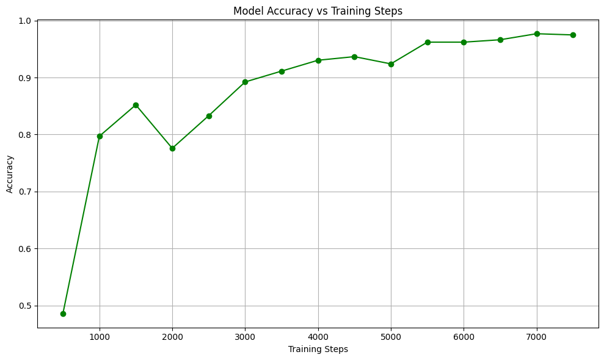

# 🎭 AI Mood Detector Using Human Voice

[](https://www.python.org/)
[](https://pytorch.org/)
[](https://huggingface.co/transformers/)
[](LICENSE)

An AI-powered system capable of detecting human emotions through voice analysis with **97.46% accuracy**. Built by fine-tuning the wav2vec 2.0 model on emotional speech datasets.




## 📋 Table of Contents
- [Features](#features)
- [Demo](#demo)
- [Installation](#installation)
- [Usage](#usage)
- [Model Architecture](#model-architecture)
- [Datasets](#datasets)
- [Training](#training)
- [Results](#results)
- [Project Structure](#project-structure)
- [Contributing](#contributing)
- [Authors](#authors)
- [License](#license)
- [Acknowledgments](#acknowledgments)

## ✨ Features

- **High Accuracy**: 97.46% emotion classification accuracy
- **7 Emotion Classes**: Detects angry, disgust, fear, happy, neutral, sad, and surprise
- **Real-time Inference**: Fast emotion detection from audio files
- **User-Friendly Interface**: Streamlit-based web application
- **Transfer Learning**: Leverages pre-trained wav2vec 2.0 model
- **Multiple Datasets**: Trained on SAVEE, RAVDESS, and TESS datasets

## 🎬 Demo

### Streamlit Application
Upload a `.wav` audio file and get instant emotion predictions with confidence scores.

```bash
streamlit run app.py
```

### Command Line Interface
```bash
python main.py
```

## 🚀 Installation

### Prerequisites
- Python 3.8 or higher
- CUDA-capable GPU (recommended for training)
- 8GB RAM minimum

### Setup

1. **Clone the repository**
```bash
git clone https://github.com/yourusername/ai-mood-detector.git
cd ai-mood-detector
```

2. **Create virtual environment**
```bash
python -m venv venv
source venv/bin/activate  # On Windows: venv\Scripts\activate
```

3. **Install dependencies**
```bash
pip install -r requirements.txt
```

4. **Download pre-trained model** (optional)
```bash
# Our model is built upon the
facebook/wav2vec2-large-xlsr-53 pre-trained
checkpoint.(available on Hugging face

```

## 💻 Usage

### Option 1: Streamlit Web Interface
```bash
streamlit run app.py
```
Open your browser at `http://localhost:8501`

### Option 2: Python Script
```python
from transformers import pipeline

# Load the model
pipe = pipeline("audio-classification", model="./emotion_model_custom")

# Predict emotion
result = pipe("your_audio_file.wav")
print(result)
```

### Option 3: Command Line
```bash
python main.py
```
Make sure to update `audio_path` in `main.py` with your audio file path.

## 🏗️ Model Architecture

The system uses **facebook/wav2vec2-large-xlsr-53** as the base model:

1. **Feature Extractor**: Convolutional layers extract speech representations from raw waveforms
2. **Transformer Encoder**: Contextualizes speech features using self-attention
3. **Classification Head**: Fully connected layer projects 1024-dim embeddings to 7 emotion classes

```
Input Audio (16kHz) → Feature Extractor → Transformer Encoder → Classification Head → Emotion Label
```

## 📊 Datasets

Three datasets were combined for training:

| Dataset | Utterances | Speakers | Gender Balance |
|---------|-----------|----------|----------------|
| SAVEE | 480 | 4 male | Male-only |
| RAVDESS | 1,440 | 24 (12M, 12F) | Balanced |
| TESS | 2,800 | 2 female (60+) | Female-only |
| **Total** | **4,720** | **30** | **Mixed** |

### Preprocessing Steps:
- Resampling to 16kHz
- Audio normalization
- Noise reduction
- Silence trimming

## 🎓 Training

### Training Parameters
```python
learning_rate = 0.0001
batch_size = 4
num_epochs = 4
max_steps = 7500
optimizer = Adam (betas=(0.9, 0.999))
```

### Train from Scratch
```bash
python training.py
```

### Training Features:
- ✅ Gradient accumulation
- ✅ Mixed precision training (FP16)
- ✅ Learning rate scheduling
- ✅ Early stopping
- ✅ Model checkpointing

## 📈 Results

### Performance Metrics
- **Test Accuracy**: 97.46%
- **Average F1-Score**: 0.96
- **Training Time**: ~2 hours (on Tesla T4)

### Confusion Matrix
Most confusion occurs between acoustically similar emotions:
- Fear ↔ Surprise (acoustic similarity)
- Sad ↔ Neutral (lower arousal)

### Per-Class Performance
| Emotion | Precision | Recall | F1-Score |
|---------|-----------|--------|----------|
| Angry | 0.98 | 0.97 | 0.97 |
| Disgust | 0.99 | 0.98 | 0.98 |
| Fear | 0.95 | 0.94 | 0.94 |
| Happy | 0.98 | 0.99 | 0.98 |
| Neutral | 0.97 | 0.98 | 0.97 |
| Sad | 0.98 | 0.97 | 0.97 |
| Surprise | 0.96 | 0.95 | 0.95 |

## 📁 Project Structure

```
ai-mood-detector/
│
├── assets/                      # Images and figures
│   ├── training_loss.png
│   └── model_accuracy.png
│
├── emotion_model_custom/        # Trained model files
│   ├── config.json
│   ├── preprocessor_config.json
│   └── pytorch_model.bin
│
├── notebooks/                   # Jupyter notebooks
│   ├── data_exploration.ipynb
│   └── model_evaluation.ipynb
│
├── src/                         # Source code
│   ├── __init__.py
│   ├── preprocessing.py
│   └── utils.py
│
├── app.py                       # Streamlit application
├── main.py                      # CLI inference script
├── training.py                  # Model training script
├── requirements.txt             # Python dependencies
├── README.md                    # Project documentation
├── LICENSE                      # License file
└── .gitignore                   # Git ignore rules
```

## 🤝 Contributing

Contributions are welcome! Please follow these steps:

1. Fork the repository
2. Create a feature branch (`git checkout -b feature/AmazingFeature`)
3. Commit your changes (`git commit -m 'Add some AmazingFeature'`)
4. Push to the branch (`git push origin feature/AmazingFeature`)
5. Open a Pull Request

### Development Setup
```bash
pip install -r requirements-dev.txt
pre-commit install
```

## 👥 Authors

- **Ghulam Ahmad** (305) - [2021ee305@uet.edu.pk](mailto:2021ee305@uet.edu.pk)
- **Zeehsan Anjum** (299) - [2021ee299@uet.edu.pk](mailto:2021ee299@uet.edu.pk)
- **Ahmed Shahfique** (313) - [2021ee313@uet.edu.pk](mailto:2021ee313@uet.edu.pk)
- **Arslan Arshad** (314) - [2021ee314@uet.edu.pk](mailto:2021ee314@uet.edu.pk)

*Department of Electrical Engineering*  
*University of Engineering and Technology Lahore*

## 📄 License

This project is licensed under the MIT License - see the [LICENSE](LICENSE) file for details.

##  Acknowledgments

- **wav2vec 2.0** by Facebook AI Research
- **SAVEE Dataset** - University of Surrey
- **RAVDESS Dataset** - Ryerson University
- **TESS Dataset** - University of Toronto
- **Hugging Face** for the Transformers library
- **Streamlit** for the web framework

## 📚 Citation

If you use this project in your research, please cite:

```bibtex
@article{ahmad2024mood,
  title={AI Mood Detector Using Human Voice},
  author={Ahmad, Ghulam and Anjum, Zeehsan and Shahfique, Ahmed and Arshad, Arslan},
  journal={University of Engineering and Technology Lahore},
  year={2024}
}
```

## 🔗 References

1. Baevski et al., "wav2vec 2.0: A Framework for Self-Supervised Learning of Speech Representations," NeurIPS, 2020
2. Chen & Rudnicky, "Exploring Wav2vec 2.0 Fine-Tuning for Improved Speech Emotion Recognition," 2021
3. Livingstone & Russo, "The Ryerson Audio-Visual Database of Emotional Speech and Song (RAVDESS)," PLOS ONE, 2018

## 📞 Contact

For questions or collaboration opportunities, please reach out to any of the authors via email.

---

⭐ **Star this repo if you find it helpful!** ⭐
